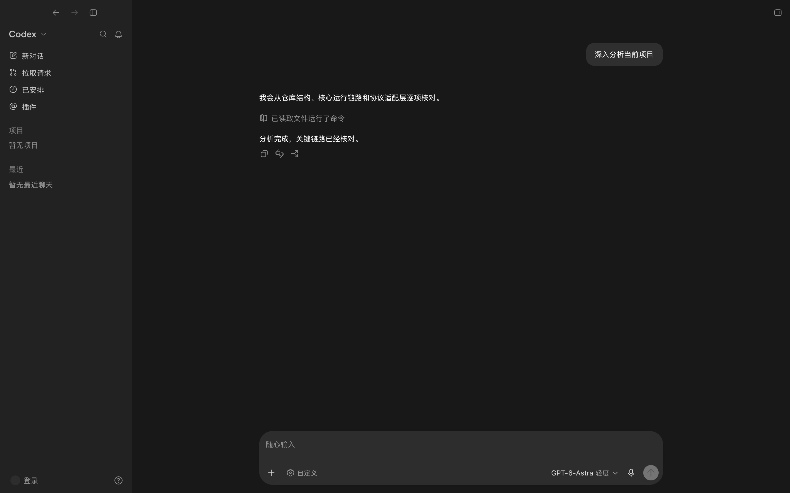
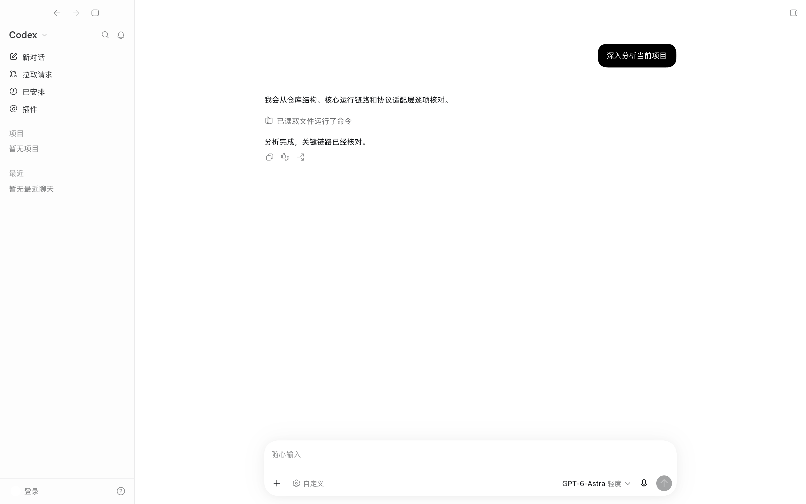

<h1 align="center">Echora</h1>

<p align="center"><strong>ChatGPT’s interaction experience, rebuilt in native GPUI.</strong></p>
<p align="center"><strong>GUI built entirely by GPT-6-Astra.</strong><br>Powered by Codex app-server. Working toward the complete ChatGPT app experience.<br>More coding agents will join the same familiar workflow.</p>
<p align="center"><strong>English</strong> · <a href="README.zh-CN.md">简体中文</a></p>

<p align="center">
  
  <a href="https://github.com/rita152/Echora"></a>
  <a href="rust-toolchain.toml"></a>
  <a href="Cargo.toml"></a>
  
</p>



## The idea behind Echora

**The GUI in this repository was created entirely by GPT-6-Astra.** Echora is the product name; GPT-6-Astra is the model that built it. The name draws on *echo*: bringing the ChatGPT app’s interaction experience into a native Rust and GPUI application.

The ambition is to **recreate the complete ChatGPT desktop app interaction experience through Codex app-server**. That means the details of the workflow as well as the appearance: starting and restoring conversations, streaming replies, steering active turns, approving actions, editing files, using terminals, reviewing changes, and navigating settings.

As more coding agents are integrated, users should be able to keep that same workflow while working with products from different providers. The interface stays familiar as the choice of agents grows.

| Part of the project | Role |
|---|---|
| **GPT-6-Astra** | Created the GUI implementation in this repository. |
| **Rust + GPUI** | Render the native application and handle its interactions. |
| **Codex app-server** | Connects the GUI to Codex’s backend capabilities. |
| **ChatGPT app** | The reference for the complete interaction experience being recreated. |
| **Other coding agents** | Future integrations through provider-specific adapters. |

**Implementation status:** full interaction parity is the goal. Today, only part of Codex app-server is connected; some navigation and settings entries remain placeholders, and other coding agents are not integrated yet. [The integration table](docs/APP_SERVER_INTEGRATION.md) records the actual coverage. Echora is an independent application, not an official OpenAI product or an extension running inside ChatGPT.

<details>
<summary>See the light theme</summary>



</details>

Both images are captured from the current native application using the worktree's packaged capture bundle (`scripts/package_gpui_capture.sh`) and a deterministic example of conversation and tool activity (`--tool-group-state=completed`) against an empty `CODEX_HOME`, so no local projects or chats appear; the displayed commands are not run and no model request is sent. The interface currently retains some Codex labels. These are application screenshots, not design mockups.

## What you can do today

| Workflow | Available behavior |
|---|---|
| **Projects & conversations** | Create, restore, search, rename, archive, delete, move, and pin conversations. Switching conversations keeps background turns running. |
| **Follow activity** | The sidebar bell (or `Option+Cmd+U`) swaps projects and recents for the activity view: a Priority section of chats that are running, waiting for an approval or reply, or have an unread turn, then the last seven days grouped under Today, Yesterday, and weekday headings that stay pinned while their rows scroll, ten rows at a time. A chat stays in Priority after it is read until `Clear read chats`; chats that start needing attention are added as they do. Rows open their chat without leaving the view, show the project (or Codex) they belong to, and offer Pin and Archive on hover. The `…` menu shows or hides the Priority and Pinned sections, marks Priority read, and archives it after a confirmation. |
| **Talk while the agent works** | Stream responses and send additional input into an active turn. Plans, search, waits, tool activity, and file changes appear in the timeline. A reply that is still arriving is revealed at the ChatGPT app's adaptive cadence (a 50 ms drain whose rate follows the backlog) with each new word, inline code span, and link fading in over 0.7 s and list items, table rows, quotes, and rules over 0.15 s; half-written syntax never flashes, because an unfinished link, image, or citation on the last line stays hidden until it closes and a dangling `*` or `**` is closed early. The completion snapshot shows the whole text at once, and reduced motion prints deltas as they arrive. |
| **Navigate by prompt** | Jump between a conversation's user prompts from the rail at the left of the transcript: markers highlight the turns on screen and taper around the pointer at once, easing with the ChatGPT app's 160 ms spring. A preview opens 250 ms after the pointer reaches the rail (at once when it returns within 300 ms), follows the hovered marker, and stays open while the pointer travels onto it; it repeats the prompt above the last reply that prompt received in its turn, laid out like ChatGPT's three-line Markdown preview (code blocks as plain text, the same paragraph spacing). Clicking a marker scrolls smoothly to a nearby turn (instantly to a distant one) and flashes its bubble; pressing and dragging along the rail scrubs the transcript. Alt+↑ / Alt+↓ step to the previous or next prompt from anywhere in the conversation, including the composer. A turn's first prompt lands 16 px below the top, a steering prompt at the top, and the transcript stays visible under the transparent thread header. A long rail scrolls on its own, fades at its edges, and keeps the current marker in view; the wheel over it never scrolls the transcript. Marking a turn stores a bookmark for this run of the app; the Codex app-server has no bookmark method, so Echora keeps those keys itself. |
| **Approve actions** | Inspect command, file, and extra-permission requests in native cards. View automatic review outcomes and choose supported permission profiles. |
| **Answer MCP requests** | Answer `mcpServer/elicitation/request` in native form and url cards: validate required, typed, ranged, and enumerated fields, send structured content only on accept, map skip and cancel to their own protocol actions, and settle only after `serverRequest/resolved`. |
| **Start a chat** | Empty chats show the project heading and composer without placeholder suggestions. |
| **Work with files** | Browse the local file tree, filter paths, edit in tabs, preview Markdown and images, and follow file links to a line. |
| **Use the terminal** | Run the local shell in the conversation directory, with tabs, scrollback, text selection, and clipboard support. |
| **Review & ship changes** | Inspect Git diffs, comment on lines, stage, restore, commit, create branches, push, and open pull requests through the local `gh` CLI. |
| **Browse pull requests** | Open the sidebar's `Pull requests` page: list and filter pull requests, read the summary, activity, commits and checks, browse the diff with its file tree, review lines inline, and open a review tab from the change stats. |
| **Explore in side chats** | Fork temporary conversations from the main thread, with their own input, model, permissions, and stop controls. |
| **Configure Codex** | Read effective configuration and its sources, inspect managed restrictions, edit supported user settings, and verify saves against the backend. |
| **Hooks, experimental features & memories** | Settings → Hooks lists the hooks from `hooks/list` by source, with review and load-issue summaries, per-hook and trust-all trust, enable switches (managed hooks stay on), details, reload, and a link to the hook's config file. Settings → Configuration lists the server's beta features under Experimental features (Beta) with a restart note after a change. Settings → Personalization enables Codex memory, allows memories from tool-assisted chats, and deletes all memories after a confirmation; the slash menu's Memories sets a chat's memory use and generation. |
| **Code review, shell commands & sections** | The slash menu's Code review reviews uncommitted changes or the branch against a base branch with `review/start`, in this chat or, with Settings → Git → Review delivery set to Detached, in a new chat of the project; the turn shows "Review mode" and the review pane opens on the diff. A line starting with `!` runs in the chat's shell through `thread/shellCommand`, outside the sandbox. Custom sidebar sections sit between Pinned and Projects: create, rename, reorder, collapse and remove them, move chats and projects in by menu or drag, and start a chat inside one. |
| **Task summary, pull requests & background terminals** | The top bar's summary button pins a panel beside the chat (a popover when the window is narrow) with the checkout's branch and the pull requests attached to the chat (`thread/attachment/*`), where an existing pull request of the branch can be attached and any one removed, plus the chat's background processes: commands still running after their turn, which open their output in a tab and stop through `thread/backgroundTerminals/clean`. Sidebar rows show the state of the chat's pull request while idle. |
| **Choose a language** | Switch between English, Simplified Chinese, and automatic detection in Settings → General → Language. Changes apply immediately and are saved locally. |
| **Manage the account** | See the connected ChatGPT account and plan in the account menu, or the configured model provider's name when the connection is not a ChatGPT sign-in; sign in through Codex-managed ChatGPT auth when the backend requires OpenAI auth, cancel a pending login, and sign out behind a confirmation. |
| **Manage skills & MCP** | Read the skills inventory with per-skill enable/disable receipts, list MCP servers with status, auth, tools and server extensions, reload servers, and complete OAuth logins with explicit waiting, success, failure, cancellation and disconnect states. |
| **Manage plugins & apps** | Read the plugin catalog and the installed subset from the backend, search marketplaces, open a plugin's own detail (description, skills, MCP servers), install and uninstall behind a confirmation, manage marketplaces (add, update, remove), read shared plugins, and read a plugin skill's contents. Directory rows, badges and counts are always the served values; a plugin the server ships without artwork or description renders that way instead of a placeholder row. |

The exact protocol coverage and compatibility rules live in [the app-server integration table](docs/APP_SERVER_INTEGRATION.md). A visible control does not imply full support for the corresponding provider feature.

## Get started

The current development and verification platform is **macOS**. Install the Rust toolchain pinned in [rust-toolchain.toml](rust-toolchain.toml), the macOS build tools, and a logged-in Codex CLI available on `PATH`. The current integration baseline is `codex-cli 0.158.0`; see the integration table before changing CLI versions.

```bash
git clone https://github.com/rita152/Echora.git
cd Echora

rustc --version
codex --version
cargo run --release -- --theme=dark
```

Use `--theme=light` for the light theme. `cargo run -- --theme=dark` uses the optimized development profile for local iteration. Launch from the repository root for the examples below.

The interface defaults to automatic language detection: Chinese system locales use Simplified Chinese; other locales use English. Settings → General → Language saves an explicit choice. Use `--language=en`, `--language=zh-CN`, or `--language=auto` to override it for one launch without changing the saved preference. This changes application labels, not conversation messages, project names, file contents, or text supplied by the backend.

Echora starts `codex app-server --stdio` and uses the local Codex installation for backend configuration and sessions. Git review requires Git; creating pull requests also requires an authenticated `gh`. Python, Node.js, and Electron are development verification tools, not requirements for running the native interface.

The Cargo package and executable are still named `gpui-chat-clone`, so the existing build and capture commands continue to use that name. Prebuilt releases and cross-platform verification are not provided yet.

## Find your way around

The sidebar navigation shows New chat, Pull requests, Scheduled, and Plugins. The titlebar follows ChatGPT: Back, Forward, and the sidebar button while the sidebar is open, only the sidebar button once it is closed, and in a conversation also a New chat button that starts a chat the way the sidebar's row does.

| Action | Entry point / shortcut |
|---|---|
| Open a conversation | Sidebar projects, recent items, archive, or search |
| Inspect a project | Hover a sidebar project row: the card shows the project name, task count, repository, working directories, and `Edit project` |
| Inspect a task | Hover a sidebar task row inside a project: the card shows the task title with its environment icon and age, then the project it is filed under |
| Rename a task | Double click a sidebar task row: the first click opens that conversation, the second raises the same centered rename dialog ChatGPT shows (title field selected, `Cancel`, `Save`, `Esc`, the close button, or the scrim to leave it) |
| Search chats | Sidebar search button → the chat search dialog (`Enter` opens, `⌘1`–`⌘9` select, `Esc` closes) |
| Follow activity | Sidebar bell (`View activity`); `Option+Cmd+U` toggles it |
| Toggle the terminal | Right panel → Terminal; `Ctrl+Backtick` |
| Open files | Right panel → Files; `Cmd+P` |
| Open Git review | Right panel → Review; `Ctrl+Shift+G` |
| Open a side chat | Right panel menu; `Option+Cmd+S` |
| Open settings | Account menu → Settings; `Cmd+,` |
| Sign in / sign out | Account menu → the sign-in row (shown when the backend requires OpenAI auth), or `Log out` with the in-app confirmation; `Esc` closes the menu |
| Send / add input to an active turn | `Enter`; `Shift+Enter` inserts a newline; `Cmd+Enter` uses the opposite follow-up behavior for one message |
| Slash commands | Type `/` at the start of a line or after a space; `Up`/`Down` (or `Ctrl+N`/`Ctrl+P`) move, `Enter` runs, `Esc` closes |
| Find in chat | `Cmd+F` while the conversation has focus; `Cmd+G` / `Cmd+Shift+G` or `Enter` / `Shift+Enter` step through matches, `Esc` closes |
| Edit the last queued message / undo or redo a queued delete or edit | `Up` in an empty composer / `Cmd+Z`, `Cmd+Shift+Z` when the composer has no text edit to undo or redo |
| Save a file immediately | `Cmd+S` |
| Clear the terminal | `Cmd+K` |
| Switch / close side-chat tabs | `Ctrl+Tab`, `Ctrl+Shift+Tab`; `Cmd+W` |

<details>
<summary>Behavior and current boundaries</summary>

- **Active-turn input:** Settings → General → Follow-up behavior chooses between steering (`turn/steer`, the default) and queueing (`thread/queue/add`); `Cmd+Enter` does the opposite for one message, and the choice is saved with the UI preferences. Queued follow-ups appear in a tray above the composer, where each row can be sent now (steered into the running turn and removed, or started on an idle thread), edited, opened in a new side chat, deleted, or dragged to a new position. As in ChatGPT, editing takes the message out of the queue and resubmitting queues it back at its old place (or sends it right away when nothing else is running or queued); `Cmd+Z` restores a deleted message for a minute and an edited one for 30 minutes, and `Cmd+Shift+Z` redoes it. The server starts the next queued message itself when a turn completes; after you stop a turn the queue pauses until you resume it, and sending a new message then asks whether to clear it. Side chats always steer. Failed submissions can be restored with their attachments and review comments, without overwriting newer drafts or automatically starting another turn.
- **Goals:** the slash menu's Goal (or typing `/goal`) turns on the composer's Goal chip, and `/goal <objective>` sets one directly. The server then keeps working toward it on its own while the chat is idle; those turns stream into the conversation like any other, and the request shows "Sent as goal". The tray shows the goal's status and time spent, with clear, pause/resume, and edit; edit opens an "Edit goal" tab in the right panel with Revert and Save (saving also resumes a paused goal). Replacing a saved goal asks first. Stopping a turn pauses an active goal before interrupting, and a completed goal leaves the tray and is cleared; the turn that achieved it shows "Goal achieved in …" until another goal starts. Objectives over 4,000 characters are saved to a file under `$CODEX_HOME/attachments` and sent as a pointer, as in ChatGPT.
- **Slash menu:** typing `/` at the start of a line or after a space opens a menu above the composer with Code review (in a Git project with an otherwise empty composer), Goal, Compact, Plan mode (when the server offers it), Approve (while an auto-review denial can be approved), and Memories (while the memories feature is on). Typed queries are fuzzy-matched and the matched part of each title stays bright; other ChatGPT commands are not implemented.
- **Collaboration modes:** plan and default come from the connection's `collaborationMode/list` presets, read once per connection; plan is offered only when the server lists it, and your own model and effort are always used.
- **Live output and history:** live and restored completed turns use the same final-answer selection, work disclosure, response actions, and file summary. Text deltas retain their item identity; completed message snapshots reconcile the displayed text. Adjacent deltas are batched over 8 ms, and code highlighting reuses completed lines while reparsing the unfinished line. Completed turns collapse intermediate messages before the final answer. Added user messages retain their position and attachments. File changes are grouped by path while retaining the original patch. History comes from app-server; missing timing, plan snapshots, and automatic-review history are not invented.
- **Approvals:** concurrent requests appear in order, and a submitted card waits for server resolution. A failed response is visible and cannot be submitted twice. Inspect the original requested patch or expand and copy long commands. Keyboard navigation uses Tab/arrows, Enter, and Esc; `Shift+Esc` rejects a file request and stops the turn.
- **Permissions:** profiles are read across all backend pages and show unavailable choices with reasons. The menu hides the built-in `:read-only` profile and omits the subsequent-turn hint and manual reload action. Existing-thread changes become effective only after RPC success and a matching settings notification, and affect subsequent turns; a changed reviewer also switches for the running turn through `turn/settings/update`. Full access requires an in-app confirmation; side chats maintain independent settings. If another app-server holds the thread, a warning card stays above the composer while the conversation scrolls.
- **Account:** the account menu and the sign-in flow are driven by the connection's account snapshot. A missing plan is reported as unknown rather than guessed, a pending login keeps its server-issued id until the completion notification arrives, and signing out is confirmed before the request is sent. Only the Codex-managed ChatGPT login is exposed; API-key, external-token, and Bedrock variants report an explicit error. See the integration table for the exact protocol coverage.
- **Configuration:** supported edits use versioned `config/batchWrite` followed by readback. Project and managed layers are read-only. Conflicts retain the draft; unknown outcomes are not retried automatically. Saved model, reasoning, service-tier, and personality defaults apply to future threads, without hot-updating open ones.
- **Activity:** plans support streaming, progress, copying, explicit download, and read-only file tabs. Search preserves queries and results; waits retain duration and status. Hook feedback is read-only. Automatic-review details support keyboard navigation and text selection, and follow reduced-motion preferences. A denied automatic review shows why it was denied and what approval allows, with an Approve link that records one retry through `thread/approveGuardianDeniedAction` without running the action; the slash menu's Approve lists the ten newest approvable denials. Authentication recovery and deprecation-display boundaries are documented in the integration table.
- **File editing:** autosave runs about 400 ms after typing stops; undo and redo also write to disk. UTF-8 BOM, CRLF, and permissions are retained, and external edits are checked before saving. Text files are limited to 2 MiB and individual lines to 64 KiB; files are local only.
- **Git review:** scopes include the last turn, uncommitted, unstaged, staged, committed, and branch changes; branch review uses merge-base. Unified/split views, word diffs, context expansion, and line comments are available. Writes validate the worktree and index first. Restoring a newly added file preserves a backup under the worktree Git directory's `gpui-discarded/`.
- **Pull requests:** the page uses authenticated `gh` reads and writes. Filters, reviewer search, summaries, activity, checks, and commit scopes use GitHub data. The diff cycles unified, split, and auto (split only for files with both additions and deletions) layouts, with word highlighting, Markdown previews, a floating file tree, and inline comments; file links open the selected commit on GitHub. The Code tab reports the unmodified lines between hunks; a review tab (opened from the change stats) reads each file it shows, reveals those lines 100 at a time, counts the lines after the last hunk, and scopes the diff to all changes or one commit from its `Commits` menu. Writes retain drafts on failure, prevent duplicate submissions, and refresh from GitHub on success. “Draft description in chat” opens a prefilled conversation for review before sending. Narrow windows switch between the list and detail with a Back control. With the sidebar closed, the list header and a full-width detail or review tab start after the traffic lights and the sidebar trigger, as in ChatGPT. The list and the detail body reserve a scrollbar gutter only for classic scrollbars, not for macOS overlay scrollbars.
- **Panel lifetime:** collapsing panels or switching conversations preserves their state. Shell sessions and temporary side chats do not survive app exit. Tabs can be reordered by dragging; closing a side chat with messages requires confirmation. Disconnected side chats remain readable and copyable.
- **Activity view:** running and waiting states come from `thread/status/changed` on Echora's own app-server connection, so a chat running in another client (the ChatGPT app, for example) does not show as running here. App-server has no read state: a chat whose turn finishes, or that asks for an approval or input, while it is not on screen is marked unread by Echora itself, saved with the UI preferences, and read again when it is opened or through `Mark all as read`. The `Scheduled` option is saved but has nothing to include, since no thread source identifies scheduled runs yet; the reference's one-time coachmark and `⌘1`–`⌘9` row shortcuts are not implemented.
- **Chat search:** the dialog lists pinned chats first and then recency order, capped at nine rows, and searches through app-server `thread/search` once a query is typed. The reference app also merges ChatGPT cloud conversations from its own search service, which app-server does not expose, so matching and ordering can differ once a query has many hits. `Search files` (or `⌘P`) switches the same dialog to file search: it opens a `fuzzyFileSearch` session for the conversation working directory, streams `sessionUpdated` results as you type, highlights the server match indices, and opens the chosen file in the file panel. Servers without session support fall back to the one-shot `fuzzyFileSearch` request.
- **Rewrite a message:** the newest user message offers an edit action in its hover actions. Submitting the rewritten text calls `thread/revert` with that turn as `beforeTurnId`, which replaces the durable history with the prefix before it, and then starts a fresh `turn/start`. Only conversation history moves; local files are untouched, and the turns reload through the normal paging path.
- **Find in chat:** `Cmd+F` in the conversation opens a find bar backed by `thread/searchOccurrences` (first 250 matches, `+` when more exist, further pages read as you step past them). Matches are highlighted in rendered messages, the current one in orange; a match in a turn that is not loaded reloads the history once. Temporary side chats, which the server cannot search, are searched locally in their loaded messages. The file editor, terminal, and pull-request views keep their own `Cmd+F`.
- **Hooks, features, and memories:** hook trust and enable, experimental feature switches, and memory settings are saved immediately as versioned user-layer `config/batchWrite` edits and read back; a conflict or failure restores the served value and shows the error. The running app-server keeps the feature flags it started with, so feature changes take effect on a new Codex connection. `/memories` sends a new chat's choice with `thread/start`; once a chat has started, only memory generation can change (`thread/memoryMode/set`, rolled back on failure).
- **Compact context:** the slash menu's Compact, or typing `/compact`, runs `thread/compact/start`; it is refused with a notice while a turn runs. Compaction runs as a non-steerable turn, so additional input during it reports the server answer, and the existing context-compaction item shows the outcome.
- **Code review:** the Code review submenu lists "Review uncommitted changes" and, under "Review against a base branch", the default target branch and up to 100 recent local branches without the current one; typing after the remaining `/` filters it, and a branch list that fails to load offers Retry. Reviews always use inline delivery: Detached creates the new chat first (`thread/start` with `threadSource: code_review` and the current permissions), because 0.158 refuses detached delivery for paginated threads. A review cannot start while a turn runs. The server announces a review turn under a second turn id that never completes; Echora drops it instead of adopting a phantom turn. Restored review turns show the same request text and Review mode mark as live ones.
- **Shell commands:** while the composer starts with `!` (not in side chats, queue edits, or goal drafts) a warning chip reads "Shell · runs outside the sandbox"; Enter sends the rest of the line, a new chat is created first, and the server's user-shell turn appears as an expanded command card that can run, complete, fail, time out, or be interrupted. A rejected command returns to the composer with a notice. ChatGPT has no such entry point.
- **Custom sections:** sections and the chats in them live on the server (`threadSection/*`, `thread/section/move`); section order, the projects in each section, and collapsed sections are local UI preferences. Removing a section returns its chats to Recents. The header menu offers New chat in {section}, Edit, Archive chats, Mark all as read, and Remove section; chat and project menus offer Move to section and New section….
- **Provider capabilities and memory status:** `modelProvider/capabilities/read` gates web search in Settings → Configuration (only Disabled, with the reason, when the provider has no web search) and image-generation retry; `memory/status` adds a Memory consolidation row to Settings → Personalization and a status line to the Chat memories dialog. ChatGPT reads neither for display; both are Echora additions. `thread/loaded/list` confirms a locally loaded thread when it is opened and resumes it if the server no longer holds it.
- **Task attachments and background terminals:** pull requests attached to a chat come from `thread/attachment/list` (read in pages of 99, since 0.158 drops everything past 100 in one page) and are written only by attaching a found or newly created pull request, never by recognising commands; without server attachments a local mirror in the UI preferences stands in. Their state is read through `gh` in the background and hidden when it cannot be read; older chats without an attachment record show the pull request of their branch and are backfilled once, as in ChatGPT. A background terminal stops the whole chat's terminals in one request, with a spinner while it runs, one notice on failure, and no retry; the command cards change to "Ran …" only when the server completes them. `thread/metadata/update` records the chat's branch after each send and after a detected `git checkout`/`switch`. The summary panel's other sections, the environment and Git actions menus, and managed worktrees are not implemented.

</details>

## How it fits together

```text
GPUI application · projects · conversations · native panels
                         │
              Shared AgentBackend contract
                         │
                 Codex adapter today
                         │
               codex app-server --stdio
                         │
               Local Codex configuration & sessions
```

`ChatApp` assembles shared services and injects `AgentBackend` into the views. The backend owns project and conversation data. Echora persists UI preferences locally and does not maintain its own conversation database. Future adapters will implement the shared contract according to their actual protocols and product needs.

| Location | Responsibility |
|---|---|
| [src/agent/](src/agent/) | Backend contracts and domain types for models, messages, events, approvals, activity, configuration, and history; no GPUI dependency in domain modules. |
| [src/agent/codex/](src/agent/codex/) | Codex codecs, method validation, transport, requests, and dispatch. Connection lifecycle and routing live in `manager.rs` and `manager/`. |
| [src/workspace.rs](src/workspace.rs), [src/workspace/](src/workspace/) | Workspace state and notification merging; pagination in `loaders.rs`, atomic UI preference storage in `preferences.rs`, the sidebar activity view in `activity.rs`. |
| [src/conversation/](src/conversation/) | Conversation state, event reduction, stream batching, and history restoration; no GPUI Entity or Context. |
| [src/configuration.rs](src/configuration.rs) | Configuration drafts, save receipts, and readback verification, using types from `src/agent/config.rs`. |
| [src/i18n.rs](src/i18n.rs), [src/i18n/](src/i18n/) | UI language selection, system locale detection, and app-owned translations; no GPUI or adapter dependency. |
| [src/components/](src/components/) | Sidebar, composer, timeline, approvals, MCP requests, Markdown, files, terminal, review, Pull Requests page, chat search, account menu, and side-chat rendering and interaction. |
| [src/git_review.rs](src/git_review.rs), [src/git_review/](src/git_review/) | Git/gh operations, diffs, version validation, process cleanup, and comments, independent of GPUI and agent adapters. |
| [src/pull_requests.rs](src/pull_requests.rs), [src/pull_requests/](src/pull_requests/) | Pull request models, reads, and writes through the local `gh`, avatars, and branch associations, independent of GPUI. |
| [src/skills.rs](src/skills.rs), [src/mcp.rs](src/mcp.rs), [src/plugins.rs](src/plugins.rs), [src/apps.rs](src/apps.rs) | Management state for skills, MCP servers, plugins, and apps: snapshots, refresh cycles, and pending write intents, independent of GPUI. |
| [src/app.rs](src/app.rs), [src/app/](src/app/) | Service assembly, conversation hosts, panel mounting, project creation, and image preview. |
| [src/settings/](src/settings/), [src/media.rs](src/media.rs), [src/typography.rs](src/typography.rs) | Settings pages, shared media helpers, fonts, and typography capture. |
| [src/theme.rs](src/theme.rs), [src/assets.rs](src/assets.rs), [src/stream_capture.rs](src/stream_capture.rs) | Light and dark theme tokens, runtime asset resolution, and live-turn capture. |

On macOS, UI preferences default to `~/Library/Application Support/GPUI/ui-preferences.json`. Set `GPUI_UI_PREFERENCES_PATH` to use an isolated file during verification. Backend configuration is not stored in UI preferences.

GPUI dependencies share the pinned Zed revision in [Cargo.toml](Cargo.toml). Local patches in `vendor/gpui`, `vendor/gpui_macos`, and `vendor/gpui_apple` cover text, selection, virtual lists, and Metal compositing; review these when upgrading. `vendor/block` patches the `block` crate's Objective-C runtime symbol to avoid Rust's future-incompatibility diagnostic. OpenAI Sans is loaded from an existing local ChatGPT installation when available, with a system-font fallback. The font is not distributed in this repository.

## Development & verification

```bash
cargo fmt --check
cargo test
cargo clippy --all-targets --all-features --no-deps -p gpui-chat-clone -- -D warnings
cargo check --all-targets
cargo check --all-targets --features screenshot
cargo build --features screenshot
git diff --check
```

The warning-free Clippy requirement applies to the first-party package. Tests that make real model requests and manual scrolling benchmarks are ignored by default.

For configuration and permissions integration checks:

```bash
python3 scripts/verify_config_permissions.py --output artifacts/config-permissions-smoke
```

This uses the local CLI with an isolated configuration home and Git project under the output directory. It verifies real reads, writes, overrides, version conflicts, invalid values, null deletion, profile pagination, thread-setting receipts, and process restart. It sends no model requests and does not change the user's existing configuration.

The integration table itself is checked against the CLI schema: method sets, the default/experimental column, status counts, and the opt-out list in `src/agent/codex/runtime.rs` are re-derived, and a temporary schema export is generated when `artifacts/` is empty.

```bash
node scripts/verify_integration_table.mjs
```

### Capture the native app

Follow the dedicated-instance rules in [AGENTS.md](AGENTS.md). Package the capture bundle with the worktree's own name and identifier:

```bash
scripts/package_gpui_capture.sh
```

The script builds with `--features screenshot`, writes `target/GPUI Capture (<worktree>-<digest>).app`, copies `assets/` into `Contents/Resources/assets`, and prints the bundle path, its name, and its identifier. Launch that bundle's `Contents/MacOS/gpui-chat-clone` from the repository root with an absolute path:

```bash
GPUI_UI_PREFERENCES_PATH="$PWD/artifacts/capture-preferences.json" \
GPUI_CAPTURE_OUTPUT="$PWD/artifacts/frame.png" \
  'target/GPUI Capture (gpui-<digest>).app/Contents/MacOS/gpui-chat-clone' \
  --theme=light --window-width=1440 --window-height=900
```

Enumerate apps in Computer Use, connect to the bundle name the packaging script printed, inspect the accessibility tree and screenshot, and then navigate. Press `Cmd+Shift+F12` to save an unscaled PNG with a `.render.json` sidecar (viewport, DPR, executable, bundle identifier, and resolved assets) while the app keeps running. Close only the dedicated instance you started.

Every package's name and identifier end with the worktree slug, and the package carries its own assets, so LaunchServices can never substitute a build from another directory. Capture scripts resolve the package through `scripts/gpui_capture_binary.sh`, which repackages the working tree on every call; `GPUI_CAPTURE_SKIP_BUILD=1` reuses the existing package, and `GPUI_CAPTURE_BUNDLE` names an explicit bundle that is used as-is. `--print-diagnostics` prints the executable, bundle identity, and each assets candidate with its verdict, so a verification run can prove which build it drives. `GPUI_ASSETS_DIR` hard-overrides the search when a bundle has to read assets from somewhere else. When no candidate is usable the shell keeps running, prints the warning to stderr, and shows a red bar naming the paths it tried, so a screenshot can never silently show iconless chrome. `scripts/launch_project_hover_instance.sh` wraps the packaging identity, refuses to start when this worktree's hover instance already runs, and prints the binary path, pid, and log.

Computer Use can only drive a bundle macOS treats as a user-facing app, and driving one must not raise a privacy prompt. `scripts/launch_verify_instance.sh` packages the bundle, copies it to `~/Applications`, and starts it with `launchctl submit` plus this session's `PATH` and the real `HOME`: the GUI process then never opens a file on the external volume this repository lives on, the launch never routes through LaunchServices, and the `codex app-server --stdio` child reads the same `~/.codex` projects, threads, and sign-in as the ChatGPT app. It forwards `GPUI_UI_PREFERENCES_PATH`, `GPUI_ASSETS_DIR`, and `CODEX_HOME`; before exercising anything that writes Codex config or deletes data (hook trust, experimental features, memory switches, memory deletion), set `CODEX_HOME` to a copy of `~/.codex` (for example `cp -Rc ~/.codex/. "$HOME/Library/Application Support/echora-verify/codex-home/"`). Its `--stop` stops only the instance running from this worktree's copy. An agent-app package (`GPUI_CAPTURE_AGENT_APP=1`) hides the bundle from the Dock but also from Computer Use's app inventory. `open -n` on a bundle stored on an external volume raises “would like to access files on a removable volume”, while `launchctl submit` and a direct child of the session do not, so neither the capture scripts nor the ChatGPT reference launchers use `open -n`.

For a real live-turn capture, launch with `--capture-live-turn="$PWD/artifacts/live.png"` and submit a prompt in the capture app. It saves the completed live view before history reload, a `.json` sidecar with thread identity, activity data, then exits. It fails on interruption, turn failure or a five-minute timeout.

For automatic capture of a saved thread, append `--resume-thread=THREAD_ID --screenshot="$PWD/artifacts/resumed-thread.png"`. IDs accept a UUID or `local:<uuid>`. Optional `--resume-scroll-from-bottom=3200` sets the scroll distance; omission captures the bottom. The app waits for history, sidebar, model catalog, and three stable frames, then exits; failures and timeouts return a nonzero status. Use a thread that is not held by another active writer.

Window sizes are logical pixels; PNG resolution depends on the display's DPR. Compare the same theme, content, dimensions, DPR, and scroll position, without scaling or translating images. Keep raw captures, logs, and comparison output in `artifacts/`; curated README images live in `docs/images/`.

<details>
<summary>Additional capture and verification entry points</summary>

Full launch options are in [src/main.rs](src/main.rs).

| Option | Use |
|---|---|
| `--markdown-file=/absolute/path/to/sample.txt` | Standalone Markdown window without app-server; combine with `--window-width=480` for narrow layouts. |
| `--file-panel-root=/absolute/workspace --open-file=/absolute/file` | Real file editing, saving, and conflict checks; use disposable files. |
| `--review-root=/absolute/repository --review-filter=src/example.rs [--review-menu=scope\|options\|branch]` | Real Git review; screenshots wait for the diff to load. The menu option opens one review popup for a deterministic capture. |
| `--settings-page=appearance` | Open a settings page; slugs are the pages' `slug` fields in `src/settings/catalog_*.rs`. |
| `--language=en\|zh-CN\|auto` | Select the UI language for this launch. Set it explicitly for reproducible captures. |
| `--chat-search-state=initial\|selected\|hover\|scroll\|files-empty\|files-result\|files-loading` | Open the chat search dialog in a fixed state for capture. `--chat-search-query=` runs a real search first (a query without hits shows the empty state); `--chat-search-index=` picks the selected row, or the scroll offset in pixels for `scroll`. The `files-*` states show the file-search form with frozen results. |
| `--image-generation-ui-state=running/completed/failed/load-error` | Fixed image-generation states; completed also uses `--image-generation-path=/absolute/image.png`. |
| `--auto-approval-ui-state=inProgress/approved/denied/timedOut/aborted/strict/warning` | Automatic review; add `--auto-approval-expanded`, `--auto-approval-details-expanded`, or `--reduce-motion`. Long text and motion traces use `--auto-approval-rationale-file` and `--auto-approval-motion-output`. |
| `--runtime-ui-state=completed/running/turnless/auth-started/auth-completed/interrupted/disconnected/history/long/deprecation` | Deterministic Hook, hookPrompt, authentication, and app-notice states, without hooks or model requests. Set `GPUI_RUNTIME_AUDIT_OUTPUT` for raw state and local completion reasons. |
| `--queue-ui-state=queued/paused/confirm/menu/failed/sending/editing/restored` | The follow-up queue tray: queued rows while a turn runs, the paused banner after a stop, the send-while-paused dialog, the row menu, a failed or sending row, a message taken out for editing, and the restore notice. No queue or model request is sent. |
| `--goal-ui-state=active/paused/blocked/usage-limited/budget-limited/chip/replace/complete/edit-tab` | Goal summaries for each status, the composer's Goal chip, the replace confirmation, the finished goal turn ("Sent as goal", "Goal achieved in 3s"), and the Edit goal tab, without goal or model requests. |
| `--hooks-settings-state=overview/dialog/trusted/expanded/issues/overridden/refreshed/empty/loading/error` | Hooks settings with fixed data: the source overview, a source dialog with the trust-all banner, after trusting, expanded details, load issues, an overridden write, the refresh notice, and the empty, loading, and error states. Use with `--settings-page=hooks-settings`; nothing is written. |
| `--experimental-features-state=list/restart/empty/loading/error` | Experimental features (Beta) on the Configuration page (`--settings-page=agent`) with fixed rows, after a change (restart note), and its empty, loading, and error states. |
| `--memories-state=settings-on/settings-off/settings-unavailable/delete-confirm/deleted/delete-failed/slash/dialog-new/dialog-started/dialog-generate-off/rollback` | Codex memory settings (`--settings-page=personalization`) and their delete confirmation and notices, the slash menu with Memories, and the Chat memories dialog for a new and a started chat, with generation off, and after a rolled-back change. No memory request is sent. |
| `--find-bar-state=open/results/second/capped/none` | The find bar over a fixed "hello" chat: empty, the first of two matches, the second, a capped first page (`+`), and no results. Matching is local; no search request is sent. |
| `--slash-menu-state=menu/query/approve/compact-busy` | The slash menu with every available command, a typed `/go` query, the Approve submenu with two denials, and the danger notice for Compact during a running turn. |
| `--review-menu-state=slash/submenu/submenu-branch/loading/failed/escaped`, `--review-turn-state=running/finished`, `--review-delivery-state=inline/detached` | The Code review command and submenu (this repository's own branches), a review turn with its Review mode mark, and Settings → Git → Review delivery (`--settings-page=git-settings`). No review is started. |
| `--shell-mode-state=typing/running/completed/failed/timeout/interrupted` | The `!` shell chip and the user-shell command card in each state. |
| `--capabilities-state=unsupported/supported`, `--memory-status-state=settings-pending/settings-ready/pending/ready` | Web search gated by provider capabilities (`--settings-page=agent`), and the memory consolidation status in Settings → Personalization (`--settings-page=personalization`) or the Chat memories dialog. |
| `--sections-state=sidebar/hover/menu/thread-menu/dialog-new/dialog-edit` | Two seeded custom sections (one with two chats and a project, one empty), the header hover and menu, a chat's Move to section rows, and the New/Edit section dialogs. |
| `--auto-review-denial-state=denied/approving/approved/failed` | A denied automatic review with its approval section in each state, without sending an approval. |
| `--progress-ui-state=running/streaming/completed/interrupted` | Plan, search, and wait reduction; streaming emits timed updates and completion, and running can be interrupted. |
| `--streaming-reply-ui-state=streaming/completed` | A deterministic assistant reply fed through the reducer in timed token bursts, so a capture after a chosen `--screenshot-delay-ms=` (a wall-clock wait before the frame count starts) shows the paced reveal and word fade mid-stream; `completed` also delivers the completion snapshot, and `--reduce-motion` shows the same bursts without pacing or fading. |
| `--typography-specimen --typography-display=N` | Font samples and display selection; see `src/typography.rs`. |
| `--pull-requests [--pull-requests-select=N \| --pull-requests-title=TEXT] [--pull-requests-tab=code\|review] [--pull-requests-list-tab=all\|reviewing\|authored] [--pull-requests-status=open\|merged\|closed\|all] [--pull-requests-search=TEXT] [--pull-requests-file-tree] [--pull-requests-scroll=px] [--pull-requests-action=...] [--pull-requests-comment-menu]` | Deterministic Pull Requests states: list, tabs, search, filters, groups, detail sections, diff, file tree, review tab, and the interaction states `scripts/capture_pull_requests_gpui.sh` uses. Actions: `filter-menu`, `filter-status`, `filter-repository`, `title-edit`, `reviewers`, `status-menu`, `description-menu`, `comment-menu`, `expand-commits`, `fullscreen`, `split`, `auto-layout`, `collapse-all`, `review-options`, `inline-comment[=N]` (a draft on new-file line N of the first file), and in a review tab `scope-menu`, `scope-commits`, `scope-commit`, `scope-commit-menu`, `expand-first-gap`. |
| `--pointer=X,Y` | With `--screenshot`, moves the pointer to window point `X,Y` once the page is ready, so the capture shows that hover state and any tooltip it opens. |
| `--project-hover-card=NAME` | Opens the sidebar project hover card for the named project (or its stable id) without a pointer, for the static half of the hover-card captures. |
| `--new-chat-project=NAME` | Starts a new chat in the named project (or its stable id) through the same path as the project row's new-chat button, once the sidebar lists it, so the home heading and the composer's project and branch controls show that project. |
| `--thread-hover-card=TITLE` | Opens the sidebar task hover card for the named task (or its stable id) without a pointer, for the static half of the hover-card captures. |
| `--thread-rename=TITLE` | Opens the task rename dialog for the named task (or its stable id) without a pointer, for the static half of the rename-panel captures. |
| `--sidebar-width=PX` | Renders the sidebar at a persisted width (clamped to 240–480). The native sidebar opens at its 240 px minimum; pass the reference's persisted width (275 px until its user drags it) to match a ChatGPT capture. |
| `--sidebar-collapsed` | Starts with the sidebar closed and its transition settled: the titlebar keeps only the sidebar trigger, and pages such as Pull Requests start their headers after it. |
| `--display=N` | Opens the window on display `N` of the platform list, so one run can capture the Retina panel (DPR 2) and another an external 1x monitor. |
| `--print-diagnostics` | Prints executable path, working directory, compiled worktree, bundle name and identifier, the resolved assets base with its origin, and every assets candidate with its verdict, then exits. Use it to prove which build a verification run drives. |

`GPUI_ASSETS_DIR` points the loader at a specific assets directory and becomes the only candidate, so a wrong value fails loudly instead of silently loading assets from elsewhere. Without it the search order is: the bundle's `Contents/Resources/assets`, `assets` beside the executable, the compiled worktree, then the working directory; a candidate counts only when it contains `icons/`.

`--approval-replay=/absolute/fixture.json` replays offline JSON-RPC through production parsing and response handling. The fixture contains an `events` array from `turn/started` through items and approval requests, with optional `cwd`, `userMessage`, `assistantMessage`, and `failWrites`. Responses are written to an adjacent `.responses.jsonl`; replay does not execute commands or modify approved files.

The Pull Requests page is captured with `scripts/capture_pull_requests_reference.sh` (reference, per-theme app appearance) and `scripts/capture_pull_requests_gpui.sh both full` (native), then scored per component with `scripts/compare_pull_requests_suite.py`; `scripts/verify_pull_requests_ux_reference.mjs` drives the reference through the acceptance sequence, and `scripts/extract_pull_request_icons.mjs` re-extracts the page's inline SVG icons from the reference DOM into `assets/icons/`. Keep every raw capture, log, and score in `artifacts/`.

Visual scripts require Python 3 with Pillow, NumPy, and websocket-client. CDP scripts need Node.js with global WebSocket support. Settings checks additionally need Electron (`npm ci`) and `jq`. Capture ChatGPT references only from a dedicated debug instance using a newly allocated port:

```bash
export CHATGPT_CDP_HTTP="http://127.0.0.1:${CAPTURE_CDP_PORT:?Set a dedicated debug port}"
```

Every reference instance must show the legacy layout that Echora recreates: the sidebar sits directly on the window background, with no icon column at the far left and no gray rounded panels around the sidebar and the content. ChatGPT chooses between it and the navigation rail with Statsig gate `3085093835`, fetched anew at every launch, so a fresh instance, or even the user's own ChatGPT, may open on the rail. The rail is not a reference. `scripts/launch_chatgpt_reference.sh` and `scripts/p0/launch_reference_instance.sh` pin the legacy layout in memory once the window is up. If the sidebar does not render as `legacy`, they stop the instance and exit non-zero. A page reload drops the pin, so pin again before capturing, and capture only when the output reports `"renderedLayout": "legacy"`:

```bash
node scripts/cdp_pin_reference_layout.mjs --layout=legacy --wait=60
```

The pin writes nothing to the profile or `~/.codex`. `--wait=SECONDS` retries until the window, its Statsig client, and the requested layout are ready. `--layout=network` restores the fetched value. Without `--layout`, the script only reports the current layout, which reads `unknown` while the sidebar is not mounted or is collapsed.

| Check | Entry point |
|---|---|
| Saved threads, both themes | `python3 scripts/capture_resume_reference.py --endpoint "$CHATGPT_CDP_HTTP" --manifest /path/to/manifest.json`; `python3 scripts/capture_resume_gpui.py --manifest /path/to/manifest.json --output artifacts/resume-alignment/actual` |
| Terminal / files | `node scripts/cdp_capture_terminal.mjs artifacts/terminal`; `node scripts/cdp_capture_file_panel.mjs artifacts/file-panel` |
| Review / side chat | `node scripts/cdp_capture_review.mjs artifacts/review-reference`; `node scripts/cdp_capture_side_chat.mjs artifacts/side-chat reference` |
| Review menus | `node scripts/cdp_capture_review_menus.mjs --output=artifacts/review-menus` captures the comparison, options, and branch popups in both themes with their computed styles; `python3 scripts/compare_review_menus.py --reference DIR --gpui DIR --output DIR --scale 2` scores the captures pixel by pixel and writes the crops, diffs, and report |
| Account menu, logout | `node scripts/cdp_capture_account.mjs --output artifacts/account-phase/chatgpt-reference --theme=light`; `scripts/capture_account_gpui.sh`; `python3 scripts/compare_account_phase.py` |
| Settings matrix | `CHATGPT_CDP_HTTP="$CHATGPT_CDP_HTTP" node scripts/extract_chatgpt_settings.cjs` saves the reference's 18 settings pages (Simplified Chinese UI) as the HTML snapshots under `chat-reference/settings/` that the next steps read; `./node_modules/.bin/electron scripts/verify_chatgpt_settings.cjs`; `REFRESH_SETTINGS_REFERENCES=1 scripts/capture_settings_matrix.sh`; `python3 scripts/verify_settings_matrix.py` |
| Merged Phase 1–4 local-component gate | `python3 scripts/stage4/compare_merge_gate.py` (expects the dedicated ChatGPT/GPUI captures under `artifacts/merge-four-worktrees/`; threshold is 99% per local component) |
| Sidebar project hover card | `CHATGPT_CDP_HTTP="$CHATGPT_CDP_HTTP" node scripts/cdp_capture_project_hover.mjs --output=artifacts/project-hover/reference` captures the reference card (geometry, computed styles, icons, screenshots) after hovering the real row; `--project-hover-card=NAME --screenshot=artifacts/project-hover/gpui/light-card.png` captures the native card, and `python3 scripts/compare_project_hover.py --reference artifacts/project-hover/reference --gpui artifacts/project-hover/gpui --output artifacts/project-hover/compare` scores the two per theme. `cargo test project_hover` drives the same pointer path as a real hover (open delay, staying open over the card, closing on leave). |
| Sidebar task hover card | `scripts/capture_thread_hover_gpui.sh both` refreshes the reference with `CHATGPT_CDP_HTTP` set, captures `--thread-hover-card=TITLE` in both themes, and scores each with `scripts/compare_thread_hover.py`, which reports `pixelConsistency`, `pixelsWithin2`, `pixelsWithin12`, and the repository's `toleranceAdjustedSimilarity` together with the card's vertical anchor delta. The card opens 240 ms after the pointer enters a project task's row, stays open over the card, and is suppressed for projectless Recents rows exactly like the reference; `cargo test thread_hover` drives that pointer path. |
| Sidebar layout | `scripts/launch_chatgpt_reference.sh` starts the dedicated reference instance (own port and profile clone, the clone's stale `Singleton*` links removed so the app cannot forward into the user's window, and Chromium switches that keep a covered window rendering, since an occluded page stops taking CDP input); `CHATGPT_CDP_HTTP="$CHATGPT_CDP_HTTP" node scripts/cdp_capture_sidebar_layout.mjs --output artifacts/sidebar-layout/reference` then drives the app's own Appearance control and records every sidebar landmark (geometry, computed styles, both themes) plus window and sidebar screenshots; `--theme=dark --window-width=1440 --window-height=900 --screenshot=artifacts/sidebar-layout/gpui/dark.png` captures the native sidebar at the same viewport, and `python3 scripts/compare_sidebar_layout.py --reference …/dark-window.png --gpui …/dark.png --spec …/dark-spec.json --scale 2` aligns each landmark against the reference to report per-row drift. `scripts/cdp_sidebar_row_tree.mjs` prints the reference box tree of one row. The launcher pins the legacy layout (see above); pin again after a reload. The reference keeps its `sidebar-width` and Appearance choice under `$CODEX_HOME` (`.codex-global-state.json`, `[desktop] appearanceTheme` in `config.toml`), so launch it with `CHATGPT_REFERENCE_CODEX_HOME=DIR`, which gives the instance its own clone of `~/.codex`; without it, the capture's theme switch or a drag of its sidebar also changes the user's own ChatGPT. Match the reference's persisted width natively with `--sidebar-width=PX`, give `cdp_capture_sidebar_layout.mjs` the same `--window=WxH` (and `--theme=` to capture a single theme), and compare DPR 1 and DPR 2 by opening the native window with `--display=N` and passing `--dpr=2` to the reference capture. |
| Sidebar activity view | `CHATGPT_CDP_HTTP="$CHATGPT_CDP_HTTP" node scripts/cdp_capture_activity_view.mjs --output=artifacts/activity-view-26917/reference` clicks the reference's bell, hovers a row and the bell, opens the `…` menu and scrolls with the wheel (reading light and dark by setting `data-theme` on the dedicated instance only, at an emulated 1470×924 viewport), recording screenshots and every landmark's geometry; `scripts/capture_activity_view_gpui.sh` captures the same states natively with `--activity-open`, `--activity-hover=TITLE`, `--activity-tooltip=bell`, `--activity-options-open` and `--activity-scroll=PX` against the real app-server data, and `python3 scripts/compare_activity_view.py --reference … --gpui … --output …` reports each landmark's offset. `cargo test activity` drives the bell, rows, menu and `Clear read chats` with real clicks and status events, and `Option+Cmd+U` through the key binding. |
| Task rename dialog | `scripts/capture_thread_rename_gpui.sh both` captures the native panel first (the reference keeps a writer on every task it opens), then re-captures the reference over CDP at the same device pixel ratio and scores each theme with `scripts/compare_thread_rename.py`. The script fires the two clicks the reference expects, records the panel's geometry, computed styles, markup and screenshots, and drives Cancel, the close button, the scrim, Escape, Enter and Save — including the 59-character-plus-ellipsis cut — against real tasks; `cargo test rename_panel` covers the same contract. |
| Conversation user-message rail | `scripts/capture_user_message_rail_gpui.sh both` captures the native rail at rest and with one marker hovered, then re-captures the reference over CDP at the same viewport and scores both themes with `scripts/compare_user_message_rail.py`. The reference half (`scripts/cdp_capture_user_message_rail.mjs`) records the rail's geometry, computed styles, marker widths, tooltip delay, preview markup and screenshots while driving the app's own appearance control, a real pointer hover and a marker click; the comparison reports the rail's `pixelsWithin2`, the hover state's `toleranceAdjustedSimilarity`, the card surface's similarity and both anchor deltas. `cargo test navigation` pins the marker taper, the current-marker rule and the clamped preview's break points, and drives the rail with window events and a fake clock to pin its hover, grace, scrub and jump timing. For motion, `scripts/cdp_probe_user_message_rail_motion.mjs` records the reference frame by frame under a fixed pointer script, the capture build replays the same script with `--resume-thread=… --user-message-navigation-jump=1 --user-message-rail-motion --screenshot=PATH` (writing `PATH.motion.json`), and `scripts/compare_user_message_rail_motion.py` compares card open and close times, the skip-delay reopen, taper settle, smooth-scroll durations, the highlight, the scrub's `aria-current` sequence, every marker's card height, the Alt+arrow landings and wheel routing. |
| Follow-up queue, goals, and auto-review approval | `python3 scripts/batch1_app_server_probe.py --output artifacts/batch1-baseline-<date>` runs the local `codex app-server` against an isolated `CODEX_HOME` and a local fake Responses endpoint, recording the baseline queue, goal, collaboration-mode, and approval behavior without model requests; `--scenario guardian_live` makes the fake reviewer deny an escalated `echo` and then approves the denial, so the approve path is observed on a real 0.158 server. The native states are captured with `--queue-ui-state`, `--goal-ui-state`, `--slash-menu-state`, and `--auto-review-denial-state`, and `python3 scripts/compare_batch1_captures.py OUT ref.png:echora.png:x0,y0,x1,y1[:name] …` crops both sides with the same rectangle (no scaling or offset) and reports their similarity. `cargo test followup_tests`, `cargo test goal_tab`, and `cargo test batch1` drive the composer, Edit goal tab, and manager flows against scripted backends. |
| Turn settings, find in chat, hooks, experimental features, and memories | `python3 scripts/batch2_app_server_probe.py --output artifacts/batch2-baseline-<date>` records the 0.158 baseline of `turn/settings/update`, `thread/searchOccurrences` (pages, cursors, case, and UTF-16 ranges), `hooks/list` across user and project layers, `experimentalFeature/list`, `thread/memoryMode/set`, and `memory/reset` against an isolated `CODEX_HOME` and the fake Responses endpoint. With the dedicated reference instance running, `CHATGPT_CDP_HTTP=http://127.0.0.1:PORT node scripts/cdp_capture_batch2.mjs --output=artifacts/batch2` captures the reference states in both themes into `artifacts/batch2-<topic>-<date>/reference/`; `ECHORA_CODEX_HOME=<copy of ~/.codex> scripts/capture_batch2_gpui.sh <date>` captures the matching native states into `…/echora/` and refuses the real `~/.codex`. `cargo test batch2`, `cargo test find_tests`, and `cargo test memories_tests` drive the manager, settings, find bar, and `/memories` flows against scripted backends. |
| Code review, shell commands, provider capabilities, memory status, loaded threads, and custom sections | `python3 scripts/batch3_app_server_probe.py --output artifacts/batch3-baseline-<date>` records the 0.158 baseline of `review/start` (including its second turn id), `thread/shellCommand` (failure, timeout, interrupt, and inside a running turn), `modelProvider/capabilities/read` across providers, `memory/status`, `thread/loaded/list` paging, and `threadSection/update|delete` against an isolated `CODEX_HOME` and the fake Responses endpoint. `CHATGPT_CDP_HTTP=http://127.0.0.1:PORT node scripts/cdp_capture_batch3.mjs --output=artifacts/batch3` captures the reference states without selecting a review; `ECHORA_CODEX_HOME=<copy of ~/.codex> scripts/capture_batch3_gpui.sh <date>` captures the native ones, and `python3 scripts/compare_batch3_captures.py <date>` measures each side's panel and text rows independently (plus same-rectangle similarity where both frames align) without scaling or shifting. `cargo test batch3` and `cargo test sections_tests` drive the codecs, manager, composer, settings, workspace store, and sidebar against scripted backends. |
| Task attachments and background terminals | `python3 scripts/batch4_app_server_probe.py --output artifacts/batch4-baseline-<date>` records the 0.158 baseline of `thread/attachment/*` (identity, paging, broadcast to every connection, persistence across restarts) and `thread/backgroundTerminals/clean` against an isolated `CODEX_HOME` and the fake Responses endpoint. `python3 scripts/batch4_reference_fixture.py` seeds fixture projects and chats into the reference instance's isolated `CODEX_HOME` clone, `node scripts/cdp_capture_batch4.mjs` captures the reference (`CHATGPT_REFERENCE_WIRE_FAULTS` holds or fails the clean request), `ECHORA_CODEX_HOME=<copy of that clone> scripts/capture_batch4_gpui.sh <date>` captures the same chats natively, and `python3 scripts/compare_batch4_captures.py <date>` scores each pair on the same rectangle without scaling or shifting. `cargo test batch4`, `cargo test summary_panel`, and `cargo test pull_request` cover the codecs, manager, workspace store, summary panel, and sidebar chip. |
| Image generation | `python3 scripts/compare_image_generation_component.py --help`; supply measured equal-size crops and DPR. |
| History diagnostics | `python3 scripts/audit_resume_rendering.py --help`; rollout files are for offline diagnostics only. |

Thread manifests are JSON arrays with `id`, `title`, and `slug`. Thread/settings comparisons use 1440×900 at DPR 1 on a 1× display; the settings matrix covers 18 pages in both themes. The merged Phase 1–4 gate compares fixed local component regions after one documented 2×→1× BOX normalization and records crops, diffs, and scores in `artifacts/merge-four-worktrees/visual/final-report/`. Git-write verification uses temporary repositories and a local bare remote; PR command-chain checks use a `gh` test double.

```bash
GPUI_MARKDOWN_BENCH_FILE=docs/APP_SERVER_INTEGRATION.md \
  cargo test markdown_preview_scroll_timings -- --ignored --nocapture
GPUI_DIFF_BENCH_PATCH=/absolute/path/to/long.diff \
GPUI_DIFF_BENCH_OUTPUT=/tmp/gpui-diff-timings.json \
  cargo test long_diff_scroll_timings -- --ignored --nocapture

cargo test -p gpui_macos --lib --features font-kit typography_
cargo test -p gpui_apple --lib compositing_tests
node scripts/cdp_capture_chatgpt_typography.mjs --artifact-dir=artifacts/typography/live
node scripts/cdp_capture_typography_specimen.mjs artifacts/typography 1
"$(scripts/gpui_capture_binary.sh)" \
  --typography-specimen --screenshot=artifacts/typography/gpui-1x.png
python3 scripts/compare_typography.py \
  artifacts/typography/electron-1x.png artifacts/typography/gpui-1x.png \
  --output=artifacts/typography/comparison-1x.json
```

`cargo test live_conversation_stream_timings -- --ignored --nocapture` measures 500 live conversation updates plus GPUI layout and verifies that scrolling up stays anchored during subsequent output.

`cargo test streaming_reply` and `cargo test -- streaming::tests fade::tests repair::tests` cover the paced reveal of a streaming reply (cadence, catch-up on completion, reduced motion), the word segmentation, fade timeline, and easing behind the fade-in, and the repair of an unfinished Markdown tail.

`cargo test streaming_highlight_timings -- --ignored --nocapture` compares incremental syntax highlighting with a full parse for 500 growing Rust-code updates and checks exact span equality.

Scrolling benchmarks measure event/layout time in a GPUI test window, not screen FPS. Typography comparison counts glyph pixels only. For 2×, set the CDP scale to `2`, use a real Retina display for GPUI, and compare with `--dpr=2`. Save translucent captures separately: add `--translucent` to CDP/comparison scripts and `--typography-translucent` to GPUI. The comparison composites both alpha encodings onto the same background.

</details>

## Where Echora is heading

- Recreate the complete ChatGPT app interaction experience in native GPUI, including its detailed interaction behavior.
- Support more coding agent providers through their real protocols and capabilities.
- Unify local agent discovery, configuration, launch, sessions, and runtime status.
- Keep familiar conversation and review workflows as the choice of agents grows.
- Expand Codex coverage where it serves the product, with explicit compatibility boundaries.

These are directions, not shipped integrations or release-date commitments. For contributions, begin with [the repository conventions](AGENTS.md) and [the app-server integration table](docs/APP_SERVER_INTEGRATION.md). Keep the English and Chinese READMEs aligned when behavior changes.
